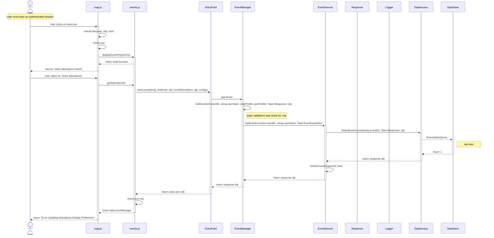

# As a Reputable, Service, Regular User or Admin, fails to display attendance on event

```mermaid
sequenceDiagram
    actor User
    participant map.js
    participant events.js
    participant EntryPoint
    participant EventManager
    participant EventService
    participant Response
    participant Logger
    participant DataAccess
    participant DataStore
    note over User: User must have an authenticated session
    User->>+map.js: User clicks on event pin
    map.js->>map.js: checkUser(user: obj): bool
    map.js->>map.js: return true
    map.js->>+events.js: displayEventPin(pinPos)
    events.js-->>map.js: return build function  
    map.js-->>-User: returns "show attendance button"
    User->>+map.js: User clicks on "show attendance"
    map.js->>events.js: getAttendance()
    events.js->>+EntryPoint: axios.post(string: endPoint, obj: eventDescription, obj: configs)
    EntryPoint->>+EventManager: app.Run()
    EventManager->>EventManager: GetEvent(int eventID, string userHash, UserProfile userProfile): Task<Response> obj
    note right of EventManager: input validations and check for role
    EventManager->>+EventService: GetEventCount(int eventID, string userHash): Task<EventCountDto>
    EventService->>+DataAccess: SelectEventCount(string eventID): Task<Response> obj
    DataAccess-->>+DataStore: ExecuteNonQuery
    note right of DataStore: sql exec
    DataStore-->>-DataAccess: return 1
    DataAccess-->>-EventService: return response obj
    EventService->>EventService: CheckCount(response): bool
    EventService-->>-EventManager: return response obj
    EventManager-->>-EntryPoint: return response obj
    EntryPoint-->>-events.js: return axios json obj
    events.js->>events.js: check json obj
    events.js-->>-map.js: return data.errorMessage
    map.js-->>-User: return "Error Updating Attendance Display Preference"
    

```