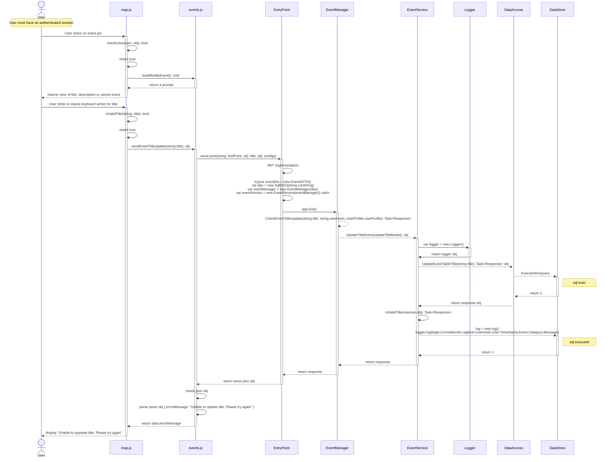

# As a Reputable User or Admin, I can modify the title of an event but fails

```mermaid
sequenceDiagram
    actor User
    participant map.js
    participant events.js
    participant EntryPoint
    participant EventManager
    participant EventService
    participant Logger
    participant DataAccess
    participant DataStore
    note over User: User must have an authenticated session
    User->>+map.js: User clicks on event pin
    map.js->>map.js: checkUser(user: obj): bool
    map.js->>map.js: return true
    map.js->>+events.js: buildModifyEvent(): void
    events.js-->>-map.js: return a prompt 
    map.js-->>-User: returns view of title, description or cancel event
    User->>+map.js: User clicks or inputs keyboard action for title
    map.js->>map.js: isValidTitle(string: title): bool
    map.js->>map.js: return true
    map.js->>+events.js: sendEventTitleUpdate(string title): obj
    events.js->>+EntryPoint: axios.post(string: endPoint, obj: title, obj: configs)
    EntryPoint->>EntryPoint: JWT implementation
    EntryPoint->>EntryPoint: try{var eventDto = new EventsDTO() <br> var dao = new SqlDAO(string conString) <br> var eventManager = new EventManager(dao) <br> var eventService = new EventService(eventManager)} catch
    EntryPoint->>+EventManager: app.Get()
    EventManager-->>EventManager: CheckEventTitleUpdate(string title, string userHash, UserProfile userProfile): Task<Response>
    EventManager-->>+EventService: UpdateTitleEvent(updateTitleModel): obj
    EventService->>+Logger: var logger = new Logger()
    Logger->>-EventService: return logger obj
    EventService-->>+DataAccess: UpdateEventTableTitle(string title): Task<Response> obj
    DataAccess-->>+DataStore: ExecuteNonQuery
    note right of DataStore: sql exec
    DataStore-->>-DataAccess: return 1
    DataAccess-->>EventService: return response obj
    EventService->>EventService: IsValidTitle(resonse obj): Task<Response> 
    EventService-->>+DataStore: log = new log()<br> logger.log(logId,CorrelationId,Loglevel,UserHash,User,TimeStamp,Event,Category,Message)
    note right of DataStore: sql executed
    DataStore-->>-EventService: return 1
    EventService-->>-EventManager: return response
    EventManager-->>-EntryPoint: return response
    EntryPoint-->>-events.js: return axios json obj
    events.js->>events.js: check json obj
    events.js->>events.js: parse jason obj { errorMessage: "Unable to update title. Please try again" }
    events.js-->>-map.js: return data.errorMessage 
    map.js-->>-User: display "Unable to upadate title. Please try again"
    

```