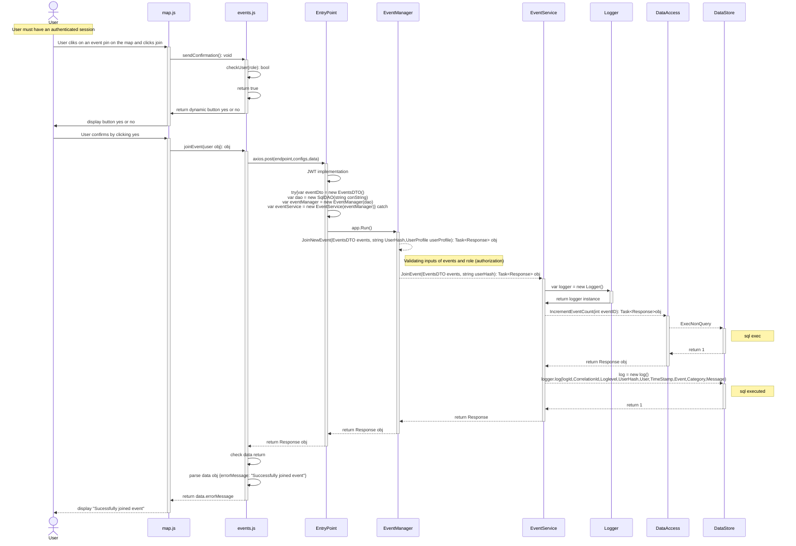

# As a User type Reputable, Service or Regular, I can join an event 

```mermaid
sequenceDiagram
    actor User
    participant map.js
    participant events.js
    participant EntryPoint
    participant EventManager
    participant EventService
    participant Logger
    participant DataAccess
    participant DataStore
    note over User: User must have an authenticated session
    User->>+map.js: User cliks on an event pin on the map and clicks join
    map.js->>+events.js: sendConfirmation(): void
    events.js->>events.js: checkUser(role): bool
    events.js->>events.js: return true
    events.js->>-map.js: return dynamic button yes or no
    map.js->>-User: display button yes or no
    User->>+map.js: User confirms by clicking yes
    map.js->>+events.js: joinEvent(user obj): obj
    events.js->>+EntryPoint: axios.post(endpoint,configs,data)
    EntryPoint->>EntryPoint: JWT implementation
    EntryPoint->>EntryPoint: try{var eventDto = new EventsDTO() <br> var dao = new SqlDAO(string conString) <br> var eventManager = new EventManager(dao) <br> var eventService = new EventService(eventManager)} catch
    EntryPoint->>+EventManager: app.Run()
    EventManager-->>EventManager: JoinNewEvent(EventsDTO events, string UserHash,UserProfile userProfile): Task<Response> obj 
    note right of EventManager: Validating inputs of events and role (authorization)
    EventManager-->>+EventService: JoinEvent(EventsDTO events, string userHash): Task<Response> obj 
    EventService->>+Logger: var logger = new Logger()
    Logger->>-EventService: return logger instance
    EventService-->>+DataAccess:   IncrementEventCount(int eventID): Task<Response>obj
    DataAccess-->>+DataStore: ExecNonQuery
    note right of DataStore: sql exec
    DataStore-->>-DataAccess: return 1 
    DataAccess-->>-EventService: return Response obj
    EventService-->>+DataStore: log = new log()<br> logger.log(logId,CorrelationId,Loglevel,UserHash,User,TimeStamp,Event,Category,Message)
    note right of DataStore: sql executed
    DataStore-->>-EventService: return 1
    EventService-->>-EventManager: return Response
    EventManager-->>-EntryPoint: return Response obj
    EntryPoint-->>-events.js: return Response obj
    events.js->>events.js: check data return
    events.js->>events.js: parse data obj {errorMessage: "Successfully joined event"}
    events.js-->>-map.js: return data.errorMessage
    map.js-->>-User: display "Sucessfully joined event"

```