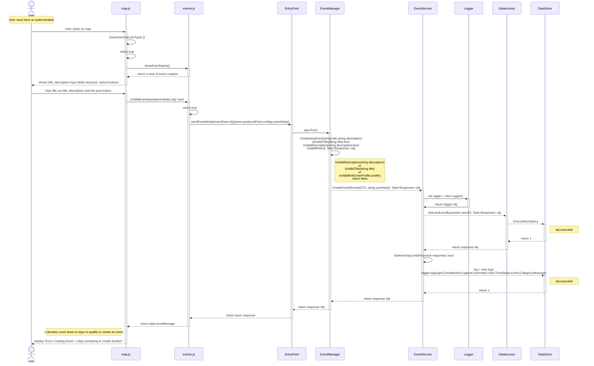

# As a Reputable User, I can create an event, but is within 7 days

```mermaid
sequenceDiagram
    actor User
    participant map.js
    participant events.js
    participant EntryPoint
    participant EventManager
    note over User: User must have an authenticated 
    User->>+map.js: User clicks on map
    map.js->>map.js: checkUser(role,pinType) {} 
    map.js->>map.js: return true
    map.js->>+events.js: showEventInputs()
    events.js-->>-map.js: return a view of event creation 
    map.js-->>-User: shows title, description input fields and post, cancel buttons 
    User ->>+map.js: User fills out title, description and hits post button 
    map.js ->>+events.js: isValidEventInputs(eventData obj): bool
    events.js->>events.js: return true
    events.js->>+EntryPoint: sendEventsData(eventData obj){axios.post(endPoint,configs,eventData)}
    EntryPoint->>+EventManager: app.Run()
    EventManager->>EventManager: CreateNewEvent(string title,string description)<br>{IsValidTitle(string title):bool<br>IsValidDescription(string description):bool <br> IsValidRole()}: Task<Response> obj
    note right of EventManager: IsValidDescription(string description) <br> or <br> IsValidTitle(string title) <br> or <br> IsValidRole(UserProfile profile) <br> return false

    EventManager-->>+EventService: CreateEvent(EventsDTO, string userHash): Task<Response> obj 
    EventService->>+Logger: var logger = new Logger()
    Logger->>-EventService: return logger obj
    EventService-->>+DataAccess: GetLastEventByuser(int userID): Task<Response> obj
    DataAccess-->>+DataStore: ExecuteNonQuery
    note right of DataStore: sql executed
    DataStore-->>-DataAccess: return 1 
    DataAccess-->>-EventService: return response obj
    EventService->>EventService: IsSevenDayLimit(Response response): bool
    EventService-->>+DataStore: log = new log()<br> logger.log(logId,CorrelationId,Loglevel,UserHash,User,TimeStamp,Event,Category,Message)
    note right of DataStore: sql executed
    DataStore-->>-EventService: return 1
    EventService-->>-EventManager: return response obj
    EventManager-->>-EntryPoint: return response obj
    EntryPoint-->>-events.js: return axios response
    events.js-->>-map.js: return data.errorMessage
    note left of map.js: x denotes count down to days to qualify to create an event
    map.js-->>-User: display "Error Creating Event. x days remaining to create another"

```