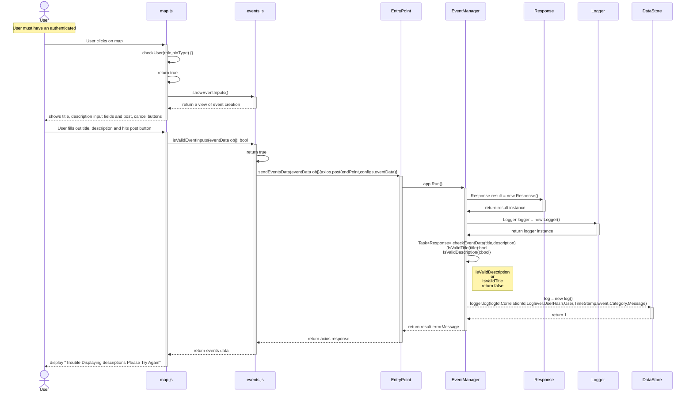

# As a Reputable User, I can create an event, but lacks a title or description

```mermaid
sequenceDiagram
    actor User
    participant map.js
    participant events.js
    participant EntryPoint
    participant EventManager
    participant Response
    participant Logger
    participant DataStore
    note over User: User must have an authenticated 
    User->>+map.js: User clicks on map
    map.js->>map.js: checkUser(role,pinType) {} 
    map.js->>map.js: return true
    map.js->>+events.js: showEventInputs()
    events.js-->>-map.js: return a view of event creation 
    map.js-->>-User: shows title, description input fields and post, cancel buttons 
    User ->>+map.js: User fills out title, description and hits post button 
    map.js ->>+events.js: isValidEventInputs(eventData obj): bool
    events.js->>events.js: return true
    events.js->>+EntryPoint: sendEventsData(eventData obj){axios.post(endPoint,configs,eventData)}
    EntryPoint->>+EventManager: app.Run()
    EventManager->>+Response: Response result = new Response();
    Response->>-EventManager: return result instance
    EventManager->>+Logger: Logger logger = new Logger();
    Logger ->>-EventManager: return logger instance
    EventManager->>EventManager: Task<Response> checkEventData(title,description)<br>{IsValidTitle(title):bool<br>IsValidDescription():bool}
    note right of EventManager: IsValidDescription <br> or <br> IsValidTitle <br> return false
    EventManager-->>+DataStore: log = new log()<br> logger.log(logId,CorrelationId,Loglevel,UserHash,User,TimeStamp,Event,Category,Message)
    DataStore-->>-EventManager: return 1
    EventManager-->>-EntryPoint: return result.errorMessage
    EntryPoint-->>-events.js: return axios response
    events.js-->>-map.js: return events data  
    map.js-->>-User: display "Trouble Displaying descriptions Please Try Again"

```