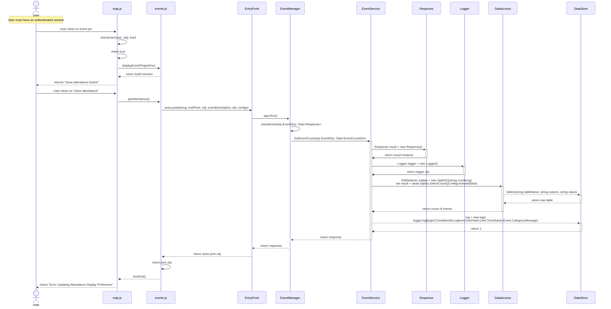

# As a Reputable, Service, Regular User or Admin, I can see the attendance of an event pin

```mermaid
sequenceDiagram
    actor User
    participant map.js
    participant events.js
    participant EntryPoint
    participant EventManager
    participant EventService
    participant Response
    participant Logger
    participant DataAccess
    participant DataStore
    note over User: User must have an authenticated session
    User->>+map.js: User clicks on event pin
    map.js->>map.js: checkUser(user: obj): bool
    map.js->>map.js: return true
    map.js->>+events.js: displayEventPin(pinPos)
    events.js-->>map.js: return build function  
    map.js-->>User: returns "show attendance button"
    User->>map.js: User clicks on "show attendance"
    map.js->>events.js: getAttendance()
    events.js->>EntryPoint: axios.post(string: endPoint, obj: eventDescription, obj: configs)
    EntryPoint->>+EventManager: app.Run()
    EventManager->>EventManager: checkEvent(obj EventDto): Task<Response> 
    EventManager->>+EventService: GetEventCount(obj EventDto): Task<EventCountDto>
    EventService->>+Response: Response result = new Response()
    Response->>-EventService: return result instance
    EventService->>+Logger: Logger logger = new Logger()
    Logger->>-EventService: return logger obj
    EventService->>+DataAccess: IDBSelector sqldao = new SqlDAO(string conString)<br>var result = await sqldao.SelectCount()ConfigureAwait(false)
    DataAccess-->>+DataStore: Select(string tableName, string column, string value)
    DataStore-->>-DataAccess: return raw table
    DataAccess-->>-EventService: return count of events
    EventService-->>+DataStore: log = new log()<br> logger.log(logId,CorrelationId,Loglevel,UserHash,User,TimeStamp,Event,Category,Message)
    DataStore-->>-EventService: return 1
    EventService-->>-EventManager: return response
    EventManager-->>EntryPoint: return response
    EntryPoint-->>events.js: return axios json obj
    events.js->>events.js: return json obj
    events.js-->>map.js: timeOut() 
    map.js-->>User: return "Error Updating Attendance Display Preference"
    

```