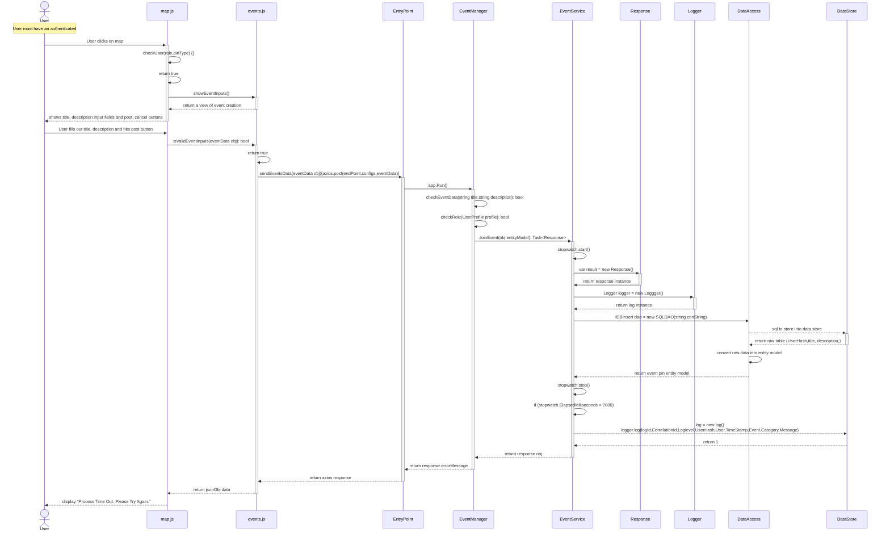

# As a Reputable, Service or Regular User, but system takes longer than 7s

```mermaid
sequenceDiagram
    actor User
    participant map.js
    participant events.js
    participant EntryPoint
    participant EventManager
    participant EventService
    participant Response
    participant Logger
    participant DataAccess
    participant DataStore
    note over User: User must have an authenticated 
    User->>+map.js: User clicks on map
    map.js->>map.js: checkUser(role,pinType) {} 
    map.js->>map.js: return true
    map.js->>+events.js: showEventInputs()
    events.js-->>-map.js: return a view of event creation 
    map.js-->>-User: shows title, description input fields and post, cancel buttons 
    User ->> map.js: User fills out title, description and hits post button 
    map.js ->>+events.js: isValidEventInputs(eventData obj): bool
    events.js->>events.js: return true
    events.js->>+EntryPoint: sendEventsData(eventData obj){axios.post(endPoint,configs,eventData)}
    EntryPoint->>+EventManager: app.Run()
    EventManager->>EventManager: checkEventData(string title,string description): bool
    EventManager->>EventManager: checkRole(UserProfile profile): bool
    EventManager->>+EventService: JoinEvent(obj entityModel): Task<Response> 
    EventService->>EventService: stopwatch.start()
    EventService->>+Response: var result = new Response()
    Response->>-EventService: return response instance
    EventService->>+Logger: Logger logger = new Loggger() 
    Logger-->>-EventService: return log instance
    EventService->>DataAccess: IDBInsert dao = new SQLDAO(string conString)
    DataAccess-->>+DataStore: sql to store into data store
    DataStore-->>-DataAccess: return raw table (UserHash,title, description,)
    DataAccess->>DataAccess: convert raw data into entity model
    DataAccess-->>EventService: return event pin entity model 
    EventService->>EventService: stopwatch.stop()
    EventService->>EventService: if (stopwatch.ElapsedMiliseconds > 7000)
    EventService-->>DataStore: log = new log()<br> logger.log(logId,CorrelationId,Loglevel,UserHash,User,TimeStamp,Event,Category,Message)
    DataStore-->>EventService: return 1
    EventService-->>-EventManager: return response obj
    EventManager-->>-EntryPoint: return response.errorMessage
    EntryPoint-->>-events.js: return axios response
    events.js-->>-map.js: return jsonObj data  
    map.js-->>User: display "Process Time Out. Please Try Again."

```