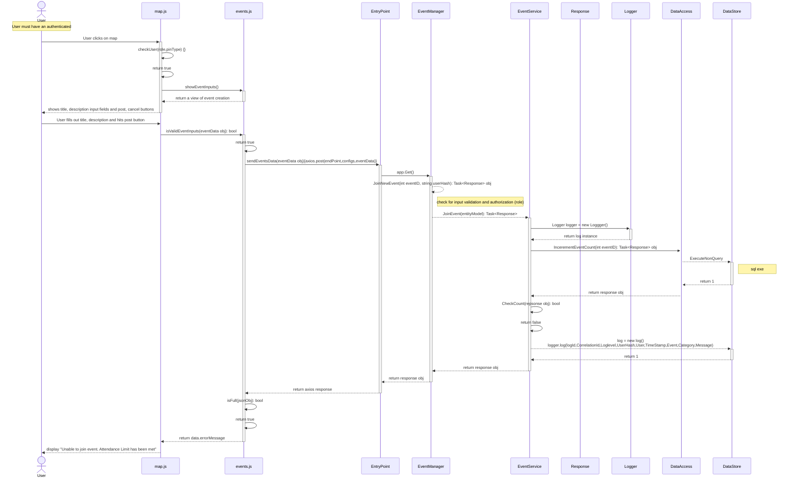

# As a Reputable, Service or Regular User, but system reads its at 100 capacity

```mermaid
sequenceDiagram
    actor User
    participant map.js
    participant events.js
    participant EntryPoint
    participant EventManager
    participant EventService
    participant Response
    participant Logger
    participant DataAccess
    participant DataStore
    note over User: User must have an authenticated 
    User->>+map.js: User clicks on map
    map.js->>map.js: checkUser(role,pinType) {} 
    map.js->>map.js: return true
    map.js->>+events.js: showEventInputs()
    events.js-->>-map.js: return a view of event creation 
    map.js-->>-User: shows title, description input fields and post, cancel buttons 
    User ->> map.js: User fills out title, description and hits post button 
    map.js ->>+events.js: isValidEventInputs(eventData obj): bool
    events.js->>events.js: return true
    events.js->>+EntryPoint: sendEventsData(eventData obj){axios.post(endPoint,configs,eventData)}
    EntryPoint->>+EventManager: app.Get()
    EventManager-->>EventManager: JoinNewEvent(int eventID, string userHash): Task<Response> obj
    note right of EventManager: check for input validation and authorization (role)
    EventManager-->>+EventService: JoinEvent(entityModel): Task<Response> 
    EventService->>+Logger: Logger logger = new Loggger() 
    Logger-->>-EventService: return log instance
    EventService->>+DataAccess: IncerementEventCount(int eventID): Task<Response> obj
    DataAccess-->>+DataStore: ExecuteNonQuery
    note right of DataStore: sql exe
    DataStore-->>-DataAccess: return 1
    DataAccess-->>EventService: return response obj
    EventService->>EventService: CheckCount(repsonse obj): bool 
    EventService->>EventService: return false
    EventService-->>+DataStore: log = new log()<br> logger.log(logId,CorrelationId,Loglevel,UserHash,User,TimeStamp,Event,Category,Message)
    DataStore-->>-EventService: return 1
    EventService-->>-EventManager: return response obj
    EventManager-->>-EntryPoint: return response obj
    EntryPoint-->>-events.js: return axios response
    events.js->>events.js: isFull(jsonObj): bool
    events.js->>events.js: return true
    events.js-->>-map.js: return data.errorMessage
    map.js-->>User: display "Unable to join event. Attendance Limit has been met"

```