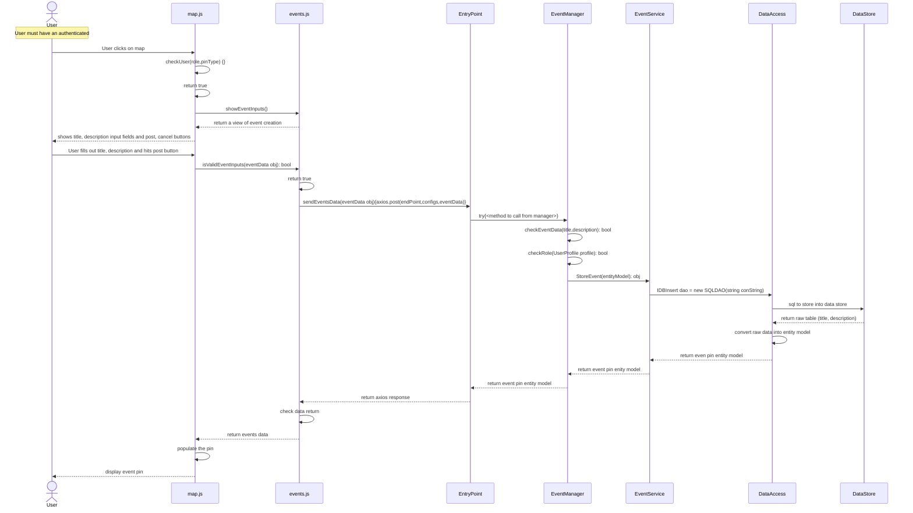

# As a Reputable User, I can create an event

```mermaid
sequenceDiagram
    actor User
    participant map.js
    participant events.js
    participant EntryPoint
    participant EventManager
    participant EventService
    participant DataAccess
    participant DataStore
    note over User: User must have an authenticated 
    User->>map.js: User clicks on map
    map.js->>map.js: checkUser(role,pinType) {} 
    map.js->>map.js: return true
    map.js->>events.js: showEventInputs()
    events.js-->>map.js: return a view of event creation 
    map.js-->>User: shows title, description input fields and post, cancel buttons 
    User ->> map.js: User fills out title, description and hits post button 
    map.js ->> events.js: isValidEventInputs(eventData obj): bool
    events.js->>events.js: return true
    events.js->>EntryPoint: sendEventsData(eventData obj){axios.post(endPoint,configs,eventData)}
    EntryPoint->>EventManager: try{<method to call from manager>}
    EventManager->>EventManager: checkEventData(title,description): bool
    EventManager->>EventManager: checkRole(UserProfile profile): bool
    EventManager->>EventService: StoreEvent(entityModel): obj
    EventService->>DataAccess: IDBInsert dao = new SQLDAO(string conString)
    DataAccess->>DataStore: sql to store into data store
    DataStore-->>DataAccess: return raw table (title, description)
    DataAccess->>DataAccess: convert raw data into entity model
    DataAccess-->>EventService: return even pin entity model 
    EventService-->>EventManager: return event pin enity model
    EventManager-->>EntryPoint: return event pin entity model 
    EntryPoint-->>events.js: return axios response
    events.js->>events.js: check data return
    events.js-->>map.js: return events data  
    map.js->>map.js: populate the pin
    map.js-->>User: display event pin


    


    
    


```
