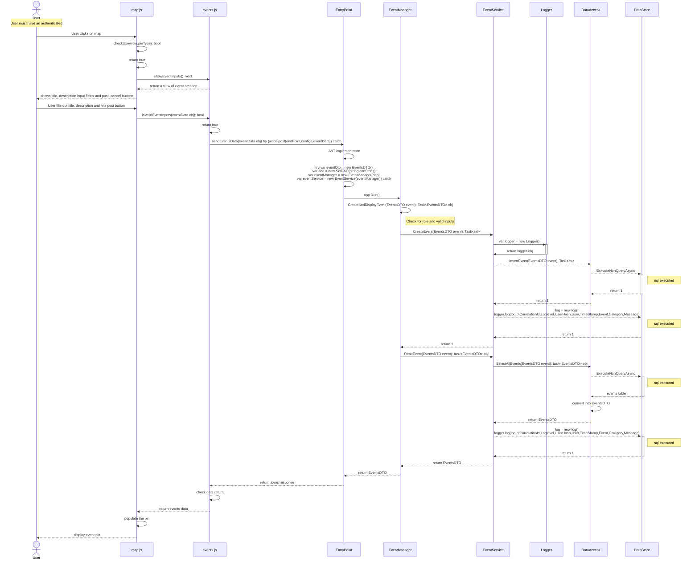

# As a Reputable User or Admin, I can create an event

```mermaid
sequenceDiagram
    actor User
    participant map.js
    participant events.js
    participant EntryPoint
    participant EventManager
    participant EventService
    participant Logger
    participant DataAccess
    participant DataStore
    note over User: User must have an authenticated 
    User->>map.js: User clicks on map
    map.js->>map.js: checkUser(role,pinType): bool
    map.js->>map.js: return true
    map.js->>events.js: showEventInputs(): void
    events.js-->>map.js: return a view of event creation 
    map.js-->>User: shows title, description input fields and post, cancel buttons 
    User ->> map.js: User fills out title, description and hits post button 
    map.js ->> events.js: isValidEventInputs(eventData obj): bool
    events.js->>events.js: return true
    events.js->>EntryPoint: sendEventsData(eventData obj) try {axios.post(endPoint,configs,eventData)} catch
    EntryPoint->>EntryPoint: JWT implementation
    EntryPoint->>EntryPoint: try{var eventDto = new EventsDTO() <br> var dao = new SqlDAO(string conString) <br> var eventManager = new EventManager(dao) <br> var eventService = new EventService(eventManager)} catch
    EntryPoint->>EventManager: app.Run()
    EventManager->>EventManager: CreateAndDisplayEvent(EventsDTO event): Task<EventsDTO> obj 
    note right of EventManager: Check for role and valid inputs
    EventManager->>EventService: CreateEvent(EventsDTO event): Task<int> 
    EventService->>+Logger: var logger = new Logger()
    Logger->>-EventService: return logger obj
    EventService-->>DataAccess: InsertEvent(EventsDTO event): Task<int>
    DataAccess-->>+DataStore: ExecuteNonQueryAsync
    note right of DataStore: sql executed
    DataStore-->>-DataAccess: return 1 
    DataAccess-->>EventService: return 1
    EventService-->>+DataStore: log = new log()<br> logger.log(logId,CorrelationId,Loglevel,UserHash,User,TimeStamp,Event,Category,Message)
    note right of DataStore: sql executed
    DataStore-->>EventService: return 1
    EventService-->>EventManager: return 1
    EventManager->>EventService: ReadEvent(EventsDTO event): task<EventsDTO> obj
    EventService->>DataAccess: SelectAllEvents(EventsDTO event): task<EventsDTO> obj
    DataAccess-->>+DataStore: ExecuteNonQueryAsync
    note right of DataStore: sql executed
    DataStore-->>-DataAccess: events table
    DataAccess->>DataAccess: convert into EventsDTO
    DataAccess-->>EventService: return EventsDTO
    EventService-->>+DataStore: log = new log()<br> logger.log(logId,CorrelationId,Loglevel,UserHash,User,TimeStamp,Event,Category,Message)
    note right of DataStore: sql executed
    DataStore-->>-EventService: return 1
    EventService-->>EventManager: return EventsDTO
    EventManager-->>EntryPoint: return EventsDTO
    EntryPoint-->>events.js: return axios response
    events.js->>events.js: check data return
    events.js-->>map.js: return events data  
    map.js->>map.js: populate the pin
    map.js-->>User: display event pin

```
