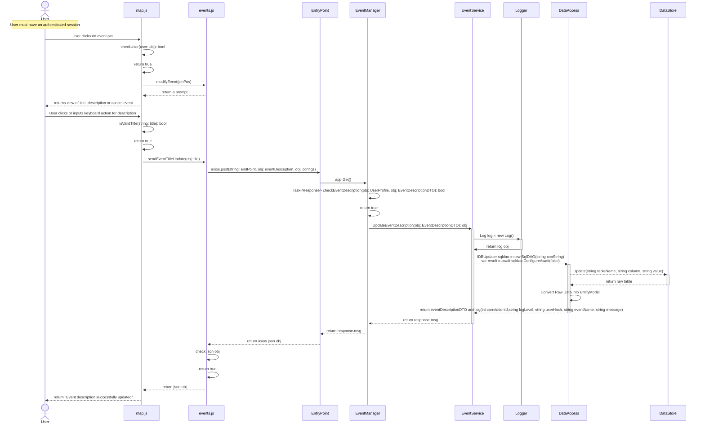

# As a Reputable User or Admin, I can modify the description of an event

```mermaid
sequenceDiagram
    actor User
    participant map.js
    participant events.js
    participant EntryPoint
    participant EventManager
    participant EventService
    participant Logger
    participant DataAccess
    participant DataStore
    note over User: User must have an authenticated session
    User->>+map.js: User clicks on event pin
    map.js->>map.js: checkUser(user: obj): bool
    map.js->>map.js: return true
    map.js->>+events.js: modifyEvent(pinPos)
    events.js-->>map.js: return a prompt 
    map.js-->>User: returns view of title, description or cancel event
    User->>map.js: User clicks or inputs keyboard action for description
    map.js->>map.js: isValidTitle(string: title): bool
    map.js->>map.js: return true
    map.js->>events.js: sendEventTitleUpdate(obj: tile)
    events.js->>EntryPoint: axios.post(string: endPoint, obj: eventDescription, obj: configs)
    EntryPoint->>+EventManager: app.Get()
    EventManager->>EventManager: Task<Response> checkEventDescription(obj: UserProfile, obj: EventDescriptionDTO): bool
    EventManager->>EventManager: return true
    EventManager->>+EventService: UpdateEventDescription(obj: EventDescriptionDTO): obj
    EventService->>+Logger: Log log = new Log()
    Logger->>-EventService: return log obj
    EventService->>+DataAccess: IDBUpdater sqldao = new SqlDAO(string conString)<br>var result = await sqldao.ConfigureAwait(false)
    DataAccess-->>+DataStore: Update(string tableName, string column, string value)
    DataStore-->>-DataAccess: return raw table
    DataAccess->>DataAccess: Convert Raw Data into EntityModel
    DataAccess-->>-EventService: return eventDescriptionDTO and log(int correlationId,string logLevel, string userHash, string eventName, string message) 
    EventService-->>-EventManager: return response.msg
    EventManager-->>EntryPoint: return response.msg
    EntryPoint-->>events.js: return axios json obj
    events.js->>events.js: check json obj
    events.js->>events.js: return true
    events.js-->>map.js: return json obj 
    map.js-->>User: return "Event description successfully updated"
    

```