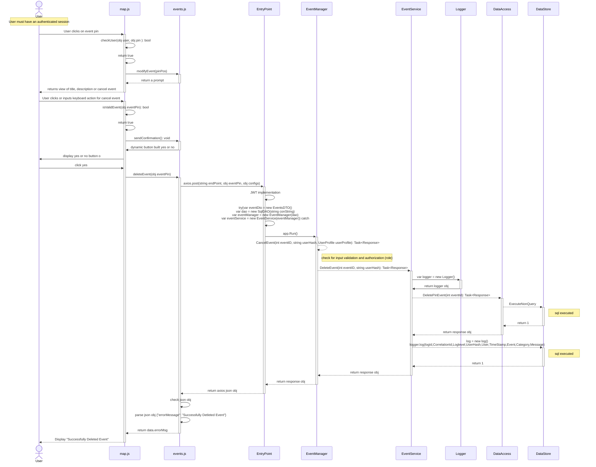

# As a Reputable User owner of an Event or Admin, I can cancel an event

```mermaid
sequenceDiagram
    actor User
    participant map.js
    participant events.js
    participant EntryPoint
    participant EventManager
    participant EventService
    participant Logger
    participant DataAccess
    participant DataStore
    note over User: User must have an authenticated session
    User->>+map.js: User clicks on event pin
    map.js->>map.js: checkUser(obj user, obj pin ): bool
    map.js->>map.js: return true
    map.js->>+events.js: modifyEvent(pinPos)
    events.js-->>-map.js: return a prompt 
    map.js-->>-User: returns view of title, description or cancel event
    User->>+map.js: User clicks or inputs keyboard action for cancel event
    map.js->>map.js: isValidEvent(obj eventPin): bool
    map.js->>map.js: return true
    map.js->>+events.js: sendConfirmation(): void
    events.js->>-map.js: dynamic button built yes or no
    map.js->>User: display yes or no button o
    User->>map.js: click yes
    map.js->>+events.js: deleteEvent(obj eventPin)
    events.js->>+EntryPoint: axios.post(string endPoint, obj eventPin, obj configs)
    EntryPoint->>EntryPoint: JWT implementation
    EntryPoint->>EntryPoint: try{var eventDto = new EventsDTO() <br> var dao = new SqlDAO(string conString) <br> var eventManager = new EventManager(dao) <br> var eventService = new EventService(eventManager)} catch
    EntryPoint->>+EventManager: app.Run()
    EventManager-->>EventManager: CancelEvent(int eventID, string userHash, UserProfile userProfile): Task<Response>
    note right of EventManager: check for input validation and authorization (role)
    EventManager-->>+EventService: DeleteEvent(int eventID, string userHash): Task<Response>
    EventService->>+Logger: var logger = new Logger()
    Logger->>-EventService: return logger obj
    EventService-->>+DataAccess: DeletePinEvent(int eventId): Task<Response>
    DataAccess-->>+DataStore: ExecuteNonQuery
    note right of DataStore: sql executed
    DataStore-->>-DataAccess: return 1
    DataAccess-->>-EventService: return response obj
    EventService-->>+DataStore: log = new log()<br> logger.log(logId,CorrelationId,Loglevel,UserHash,User,TimeStamp,Event,Category,Message)
    note right of DataStore: sql executed
    DataStore-->>-EventService: return 1
    EventService-->>-EventManager: return response obj
    EventManager-->>-EntryPoint: return response obj
    EntryPoint-->>-events.js: return axios json obj
    events.js->>events.js: check json obj
    events.js->>events.js: parse json obj {"errorMessage": "Successfully Detleted Event"}
    events.js-->>-map.js: return data.errorMsg
    map.js-->>-User: Display "Successfully Deleted Event"
    

```