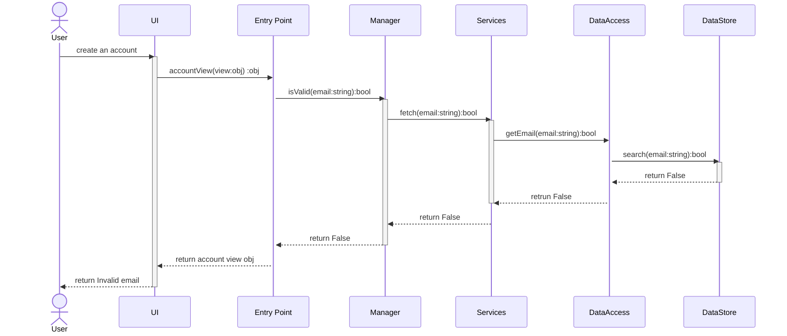

# As a user I cannot reister to create an account without a valid email

```mermaid
sequenceDiagram
    actor User
    User ->> UI: create an account
    activate UI
    UI ->> Entry Point: accountView(view:obj) :obj
    activate Entry Point
    Entry Point ->> Manager: isValid(email:string):bool
    activate Manager
    Manager ->> Services: fetch(email:string):bool
    activate Services
    Services ->> DataAccess: getEmail(email:string):bool
    activate DataAccess
    DataAccess ->> DataStore: search(email:string):bool
    activate DataStore
    DataStore -->> DataAccess: return False
    deactivate DataStore
    DataAccess -->> Services: retrun False
    deactivate Services
    Services -->> Manager: return False
    Manager -->> Entry Point: return False
    deactivate Manager
    Entry Point -->> UI: return account view obj
    UI -->> User: return Invalid email
    deactivate UI
```