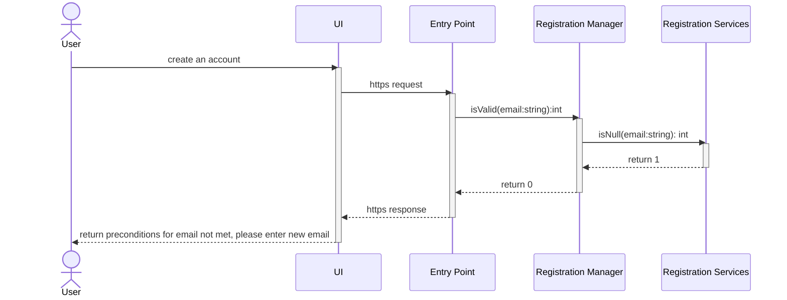

# As a user I cannot reister to create an account inserting a null string

```mermaid
sequenceDiagram
    actor User
    User ->> UI: create an account
    activate UI
    UI ->> Entry Point: https request
    activate Entry Point
    Entry Point ->> Registration Manager: isValid(email:string):int
    activate Registration Manager
    Registration Manager ->> Registration Services: isNull(email:string): int
    activate Registration Services
    Registration Services -->> Registration Manager: return 1
    deactivate Registration Services
    Registration Manager -->> Entry Point: return 0
    deactivate Registration Manager
    Entry Point -->> UI: https response
    deactivate Entry Point
    UI -->> User: return preconditions for email not met, please enter new email
    deactivate UI
```