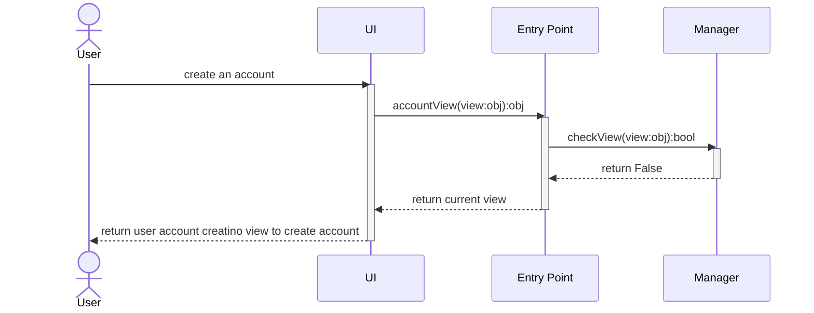

# As a user I cannot register to create an account in a different view 

```mermaid
sequenceDiagram
    actor User
    User ->> UI: create an account
    activate UI
    UI ->> Entry Point: accountView(view:obj):obj
    activate Entry Point
    Entry Point ->> Manager: checkView(view:obj):bool
    activate Manager
    Manager -->> Entry Point: return False
    deactivate Manager
    Entry Point -->> UI: return current view
    deactivate Entry Point
    UI -->> User: return user account creatino view to create account
    deactivate UI
```