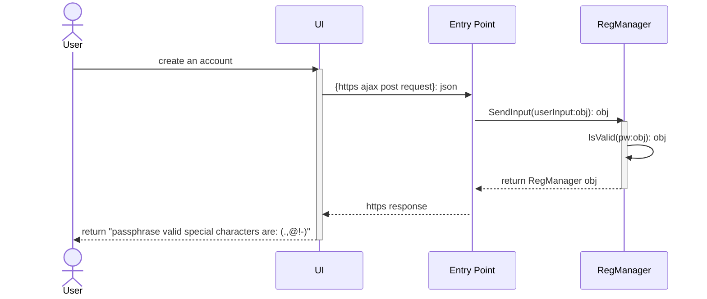

# As a user I cannot register to create an account with a passphrase that consist with special characters out of the scope requirements

```mermaid
sequenceDiagram
    actor User
    User ->> UI: create an account
    activate UI
    UI ->> Entry Point: {https ajax post request}: json
    activate Entry Point
    Entry Point ->> RegManager: SendInput(userInput:obj): obj
    activate RegManager
    RegManager ->> RegManager: IsValid(pw:obj): obj
    RegManager -->> Entry Point: return RegManager obj 
    deactivate RegManager
    Entry Point -->> UI: https response
    UI -->> User: return "passphrase valid special characters are: (.,@!-)"
    deactivate UI
```