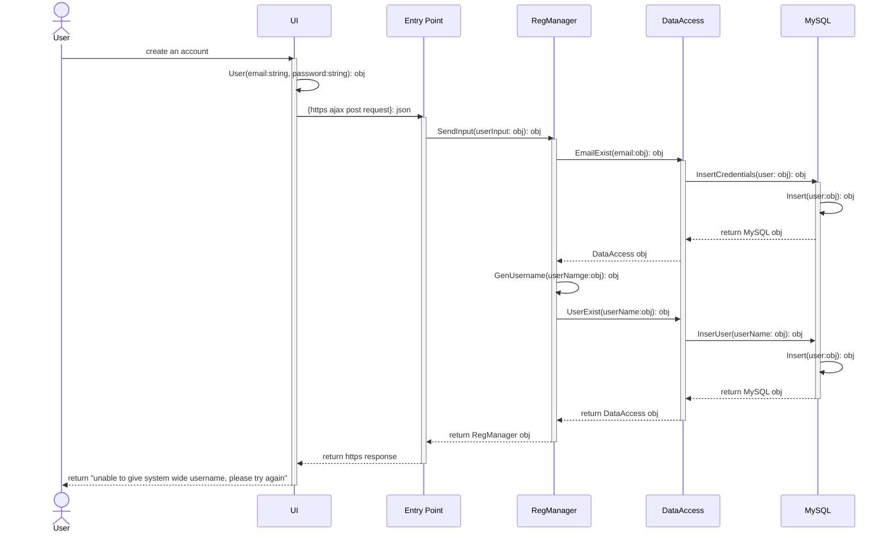

# As a user I want to register to create an account but system fails to distribute system wide username 

```mermaid
sequenceDiagram
    actor User
    User ->> UI: create an account 
    activate UI
    UI ->> UI: User(email:string, password:string): obj
    UI ->> Entry Point: {https ajax post request}: json
    activate Entry Point
    Entry Point ->> RegManager: SendInput(userInput: obj): obj
    activate RegManager
    RegManager ->> DataAccess: EmailExist(email:obj): obj
    activate DataAccess
    DataAccess ->> MySQL: InsertCredentials(user: obj): obj
    activate MySQL
    MySQL ->> MySQL: Insert(user:obj): obj
    MySQL -->> DataAccess: return MySQL obj
    DataAccess -->> RegManager: DataAccess obj
    RegManager ->> RegManager: GenUsername(userNamge:obj): obj
    RegManager ->> DataAccess: UserExist(userName:obj): obj
    DataAccess ->> MySQL: InserUser(userName: obj): obj
    MySQL ->> MySQL: Insert(user:obj): obj
    MySQL -->> DataAccess: return MySQL obj
    deactivate MySQL
    DataAccess -->> RegManager: return DataAccess obj
    deactivate DataAccess
    RegManager -->> Entry Point: return RegManager obj
    deactivate RegManager 
    Entry Point -->> UI: return https response 
    deactivate Entry Point
    UI -->> User: return "unable to give system wide username, please try again"
    deactivate UI
```