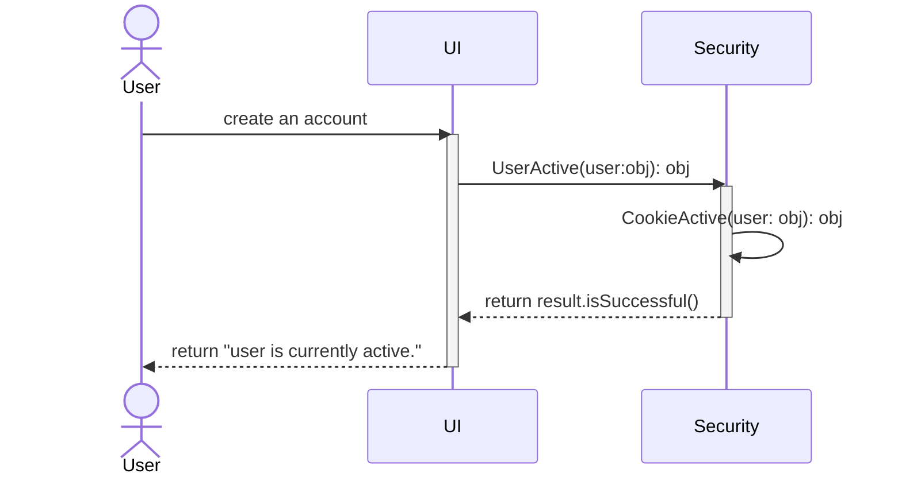

# As a user I cannot register to create an account if there exist an active session

```mermaid
sequenceDiagram
    actor User
    User ->> UI: create an account 
    activate UI
    UI ->> Security: UserActive(user:obj): obj
    activate Security
    Security ->> Security: CookieActive(user: obj): obj
    Security -->> UI: return result.isSuccessful()
    deactivate Security
    UI -->> User: return "user is currently active."
    deactivate UI 
```