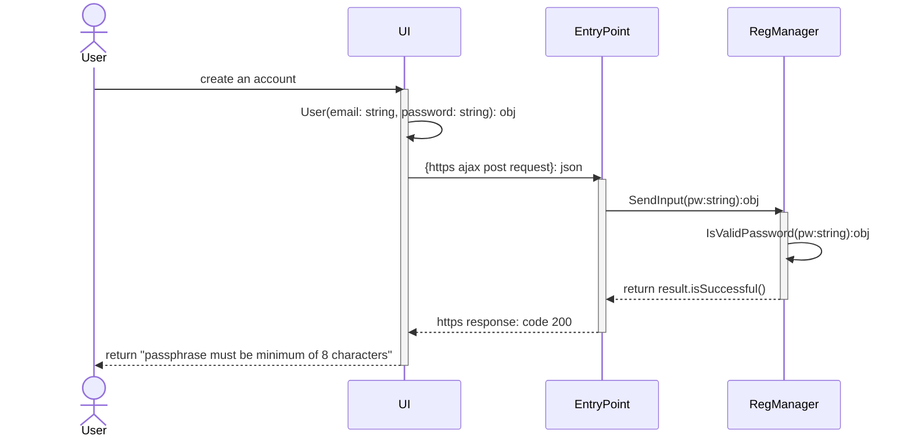

# As a user I cannot register to create an account with a passphrase of length less than 8 

```mermaid
sequenceDiagram
    actor User
    User ->> UI: create an account
    activate UI
    UI ->> UI: User(email: string, password: string): obj
    UI ->> EntryPoint: {https ajax post request}: json
    activate EntryPoint
    EntryPoint ->> RegManager: SendInput(pw:string):obj
    activate RegManager
    RegManager ->> RegManager: IsValidPassword(pw:string):obj
    RegManager -->> EntryPoint: return result.isSuccessful()
    deactivate RegManager
    EntryPoint -->> UI: https response: code 200
    deactivate EntryPoint
    UI -->> User: return "passphrase must be minimum of 8 characters"
    deactivate UI
```