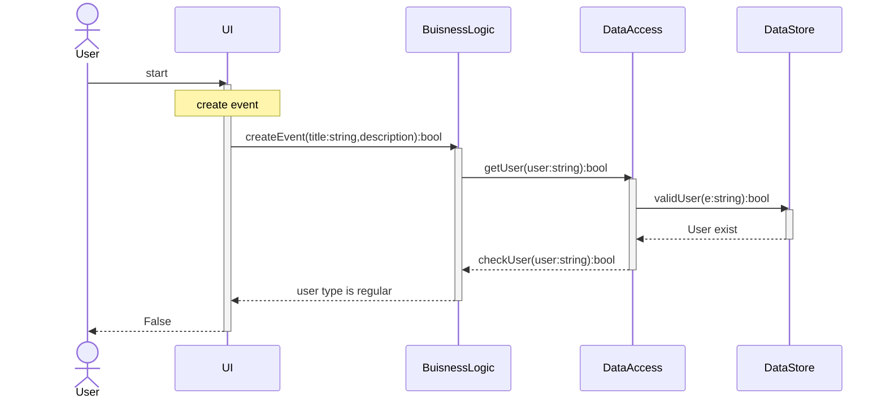

# as a user I cannot register to create an event as a regular user type

```mermaid
sequenceDiagram
    actor User
    User ->> UI: start
    activate UI
    Note over UI: create event 
    UI ->> BuisnessLogic: createEvent(title:string,description):bool
    activate BuisnessLogic
    BuisnessLogic ->> DataAccess: getUser(user:string):bool
    activate DataAccess
    DataAccess ->> DataStore: validUser(e:string):bool
    activate DataStore
    DataStore -->> DataAccess: User exist  
    deactivate DataStore
    DataAccess -->> BuisnessLogic: checkUser(user:string):bool
    deactivate DataAccess
    BuisnessLogic -->> UI: user type is regular 
    deactivate BuisnessLogic
    UI -->> User: False
    deactivate UI
```