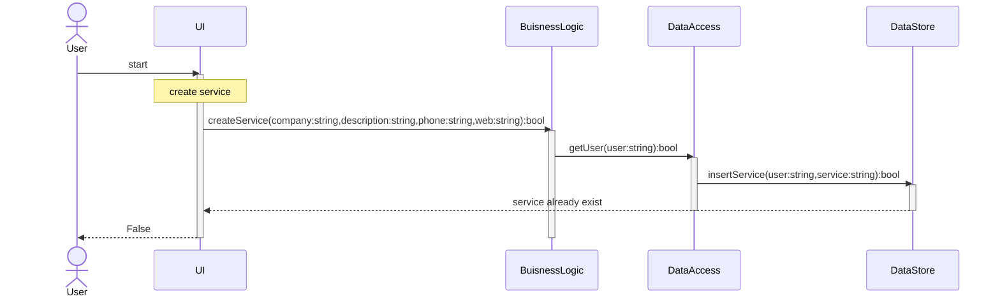

# as a user I cannot register to create a service when there is an exising service tied to user

```mermaid
sequenceDiagram
    actor User
    User ->> UI: start
    activate UI
    Note over UI: create service 
    UI ->> BuisnessLogic: createService(company:string,description:string,phone:string,web:string):bool
    activate BuisnessLogic
    BuisnessLogic ->> DataAccess: getUser(user:string):bool
    activate DataAccess
    DataAccess ->> DataStore: insertService(user:string,service:string):bool
    activate DataStore
    DataStore -->> UI: service already exist  
    deactivate DataStore
    deactivate DataAccess
    UI -->> User: False
    deactivate UI
    deactivate BuisnessLogic    
```